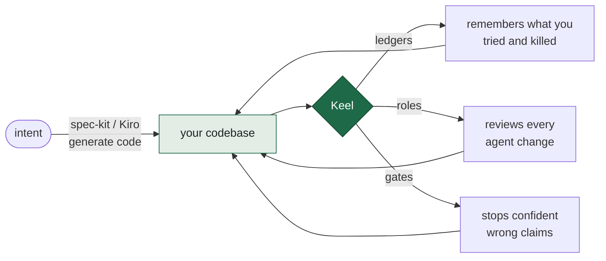
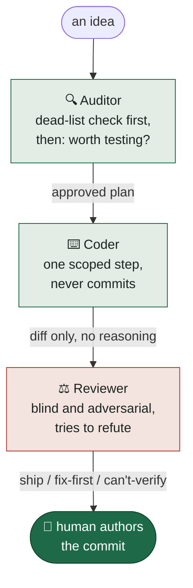

<div align="center">

<picture>
  <source media="(prefers-color-scheme: dark)" srcset="docs/assets/banner-dark.svg">
  
</picture>

<br><br>

**Keep a codebase trustworthy after thousands of AI-agent edits.**
A small set of files and rules you drop into any repo — new or old.

[](LICENSE)
[](https://github.com/cdrrazan/Keel/actions/workflows/checks.yml)
[](https://keel.byaru.com/)
[](CONTRIBUTING.md)
[](https://agents.md/)

[**Read the guide →**](https://keel.byaru.com/) · [Why](docs/guide/01-why.md) · [Principles](docs/guide/02-principles.md) · [Ledgers](docs/guide/04-ledgers.md) · [Roles](docs/guide/05-roles.md) · [Adoption](docs/guide/08-adoption.md)

</div>

---

## What is Keel?

AI coding agents are fast, but forgetful and overconfident. Over hundreds of changes they re-run dead
experiments, "helpfully" edit things you didn't ask about, and claim code works without reading it. That
quietly rots a codebase.

**Keel is the discipline that stops the rot.** It's the part of a ship that keeps it upright and on
course — and that's exactly its job here. It doesn't generate code and doesn't move the boat; it keeps
your codebase from capsizing under fast, autonomous edits.

It is **not a framework you install** and not a code generator. It's a *reliability layer*: it assumes
your code is the source of truth and governs how agents are allowed to make claims about it. It sits
happily *underneath* generation tools like [spec-kit](https://github.com/github/spec-kit) or
[Kiro](https://kiro.dev) — use those to produce code, use Keel to keep it honest.



> Adapted and structured from the original *Project-Setup Playbook for AI-Agent-Assisted Projects*
> ([gist by subzekt](https://gist.github.com/subzekt/0dfced13befee2ff29f1a61bbbd7f072)). Keel turns that
> playbook into a usable, copy-pasteable kit. See [`docs/research/playbook-analysis.md`](docs/research/playbook-analysis.md)
> for how it compares to spec-kit, Kiro, AGENTS.md, and ADR practice.

## What you get

```
.
├── AGENTS.md              # canonical rules an agent reads before touching anything
├── CLAUDE.md              # stub that imports AGENTS.md (Claude Code reads this)
├── docs/
│   ├── decisions.md       # ledger of choices made — dated, with "revisit if"
│   ├── falsified.md       # ledger of ideas KILLED — the piece nothing else has
│   ├── ai/                # durable "why" reasoning (committed)
│   ├── plans/             # ephemeral implementation notes (deleted after use)
│   └── guide/             # the full guidebook, chapter by chapter
├── roles/                 # ready-to-paste prompts: coder · reviewer · auditor
├── templates/             # copy-paste ledger entries, decision record, spec stub
├── evals/                 # eval-harness scaffold (for LLM projects)
└── .claude/hooks/         # OPTIONAL hooks that turn the gates into enforcement
```

## The five moves

Keel's whole philosophy collapses into five:

| Move | What it means |
|------|---------------|
| 📒 **Ledgers, not memory** | The agent's memory is disposable; two committed files — what you *decided* and what you *killed* — are real. |
| 👤 **Separate the roles** | Coder, reviewer, and auditor are different agents, so none grades its own work. |
| 🚧 **Gates on behavior** | Stop on ambiguity, diagnose before editing, and show evidence for every pass/fail claim. |
| ⚙️ **Deterministic core** | Logic is testable; the LLM only narrates at the edge; evals are the durable asset. |
| 🌱 **Grow when it hurts** | Start with the kernel; add structure only when its absence bites. |

## Quick start

<table>
<tr>
<th>🌱 New project (greenfield)</th>
<th>🏗️ Existing project (brownfield)</th>
</tr>
<tr>
<td valign="top">

1. Copy `AGENTS.md`, `CLAUDE.md`, and the two ledgers into your repo.
2. Fill in the *project map* in `AGENTS.md` (stack, domain terms, how to run tests).
3. Start both ledgers **empty**. Add as you go — never backfill.
4. Add linting, a lockfile, and one passing test **now** if it's a code project.
5. Grow `docs/`, `roles/`, `evals/`, and hooks only when absence causes friction.

</td>
<td valign="top">

1. Drop in `AGENTS.md` + the `CLAUDE.md` stub. **Change no code.**
2. Start both ledgers empty; fill *forward* from your next decision.
3. Introduce the **reviewer** role on your next PR.
4. Add the **auditor** once `falsified.md` has entries.
5. Adopt enforcement hooks last, once the team trusts the rules.

</td>
</tr>
</table>

No big-bang migration. Everything here is additive.

## The three roles

A single model that checks its own work is an echo chamber. Keel splits the work so nothing grades
itself — a pattern echoed in [Anthropic's best-practices](https://code.claude.com/docs/en/best-practices)
and the documented [adversarial code review](https://asdlc.io/patterns/adversarial-code-review/) pattern.



## Read the guide

The whole guide is a single self-contained web page — **[keel.byaru.com](https://keel.byaru.com/)** —
or read it chapter by chapter here:

| Chapter | What it covers |
|---|---|
| [1. Why this exists](docs/guide/01-why.md) | The rot problem; where Keel sits vs. spec-kit/Kiro |
| [2. The 15 principles](docs/guide/02-principles.md) | The whole philosophy, one line each |
| [3. The minimal kernel](docs/guide/03-kernel.md) | The four files; greenfield vs. brownfield tracks |
| [4. The two ledgers](docs/guide/04-ledgers.md) | `falsified.md` + `decisions.md`, with upgraded formats |
| [5. The three roles](docs/guide/05-roles.md) | Coder / reviewer / auditor, with prompts |
| [6. The gates](docs/guide/06-gates.md) | Ambiguity + edit gates, as advice **and** as hooks |
| [7. Applied-AI addendum](docs/guide/07-applied-ai.md) | Deterministic core, evals, experiment tracking |
| [8. Adoption & interop](docs/guide/08-adoption.md) | Walkthroughs + running alongside spec-kit/Kiro |

## Contributing

Keel eats its own dog food: decisions about it live in [`docs/decisions.md`](docs/decisions.md),
proposals carry the burden of proof, and additions need a demonstrated friction they resolve — Keel's
value is its smallness. Start with [CONTRIBUTING.md](CONTRIBUTING.md); the most valuable thing you can
send is an [experience report](.github/ISSUE_TEMPLATE/experience-report.md) from actually adopting it.
CI keeps internal links honest and enforces the ~200-line budget on `AGENTS.md`.

Also: [Code of Conduct](CODE_OF_CONDUCT.md) · [Security policy](SECURITY.md) · [Changelog](CHANGELOG.md)

## License

MIT — see [LICENSE](LICENSE). Original playbook ideas © their author; Keel is offered freely for anyone
to adapt.
